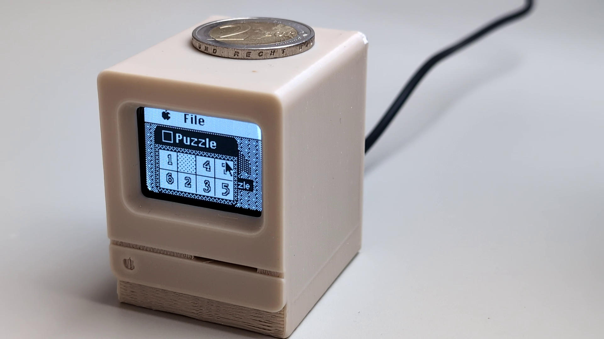

# Mini Macintosh Classic Simulator

	
	

 (Moving lines are only visible with camera)

Video: https://youtu.be/vvuhNlwmt-4

Heavily inspired by [printnplay](https://github.com/printnplay)'s video: https://www.youtube.com/watch?v=Buvo9bdydm8

I've also used his 3D model: https://www.thingiverse.com/thing:4966594

Basically the build is the same as the video, but I've written the entire software from from scratch. 
I wanted to make something that would look and feel like an original Macintosh Classic, be interactable and with the option to easily add custom apps without the need to reflash the ESP constantly.

## Features

This project simulates the Macintosh Classic in a way that feels very nostalgic with some fancy features:
### Remotely control the mouse from the HTML file on your computer
Using a websocket connection from your computer to the mini mac, you can control the mouse on the by moving/clicking on the webpage
### Run complicated apps written in JavaScript
Program your logic in javascript and visualize it on your mini mac!

Included apps:
- Clock
- Configuration panel with ability to change the background
- Hello app
- Puzzle app

## Parts used
- ESP8366 (Can relative easily be replaced with an ESP32, just some libraries will need to be replaced)
- SH1107 128x128 OLED display

## Setup
- Check that you have all used arduino libraries installed.
- Add your SSID and password to the `sketch.ino` file (lines 64 and 65)
- Connect it to the display using the I2C pins. Don't forget to connect the VCC and G as well.
- The device should boot up and go to the desktop screen (If this doesn't happen it's likely it cannot connect to your WiFi, double check your credentials in the sketch file).
- You'll see an "app" on the desktop with the IP address of the ESP. You need this to fill in the gateway variable in the `script.js` file under `html/js/`
- Run the `index.html` file and it should connect to your ESP automatically. You'll notice it connects when the IP-address app dissappears and mouse movement is synced up.

## Custom apps
Apps are written in JavaScript and all logic actually runs in your browser. From JS you can change your app visually and handle mouse press events. 

There's a handy MacApp class that can be used to quickly make your own apps(See `script.js` file). It contains handy functions such as `drawPixel()`, `drawRect()` and `drawBitmap()`.

You can check out the implementation of existing apps like `puzzle.js` or `hello.js` to quickly get started writing your own. Everything is fairly straighforward :)

Currently only 2 custom apps are supported (one menu-app and one desktop-app). You can define in the constructor of your app what type (`isDekstopApp`). To test your app you need to register it in `apps.js` and reference it `index.html`

## Handy resources:
For creating bitmap byte arrays: https://javl.github.io/image2cpp/
